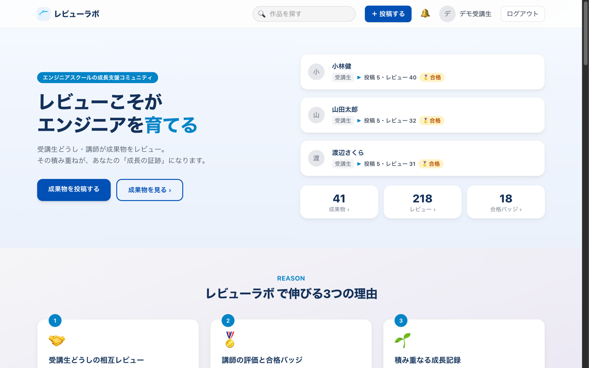
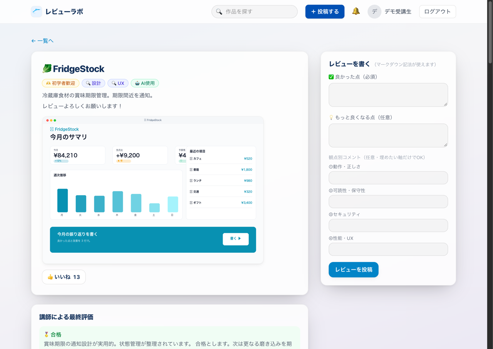
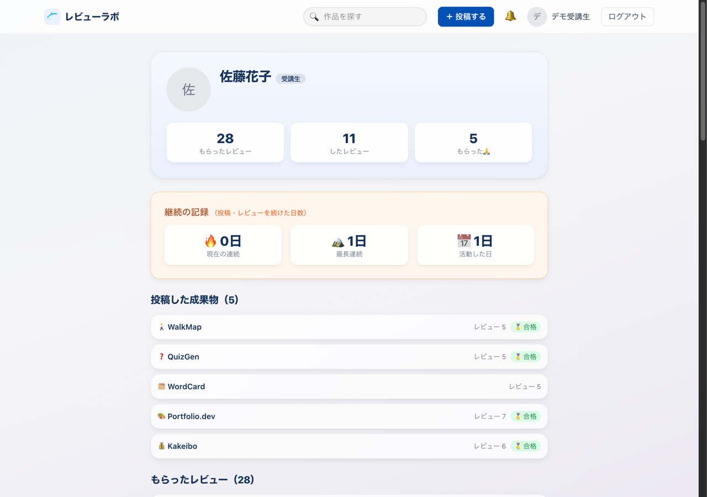
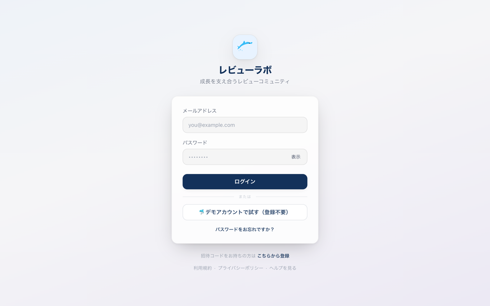

# review-board（レビューラボ） — 成果物をレビューし合い、成長の記録を積み重ねる Web アプリ

[](https://github.com/80-cloud/review-board/actions/workflows/review-board-ci.yml)
[](https://openjdk.org)
[](https://spring.io/projects/spring-boot)
[](https://react.dev)
[](https://www.postgresql.org)

エンジニアスクールの受講生どうし・講師が成果物をレビューし合い、受け取った評価と合格バッジが本人の「成長の記録」として残っていく、招待制のレビューコミュニティです。
Spring Boot 3.5 (Java 25) + React 19 + PostgreSQL 16 で作り、AWS 上で公開しています。

| 項目 | 内容 |
|---|---|
| デモ URL | https://review-board-jp.duckdns.org/ |
| 試し方 | ログイン画面の「デモアカウントで試す（登録不要）」を押すだけで、受講生として操作できます |
| 注意 | デモアカウントはみんなで共有しています。投稿やレビューはほかの訪問者からも見えます |



---

## 何ができるか

- 成果物を投稿する: タイトル・説明・スクリーンショット・デモや GitHub の URL・観点タグ（UI / コード品質 / セキュリティなど）を付けて投稿できます
- レビューし合う: 「良かった点」「もっと良くなる点」に加え、動作・可読性・セキュリティ・性能の 4 つの観点ごとにコメントを書けます。レビューへの返信と「ありがとう（🙏）」もあります
- 講師が最終評価する: 講師は成果物に最終評価を付け、合格した成果物には合格バッジが付きます
- 成長を振り返る: プロフィールに、もらったレビュー・したレビュー・連続して活動した日数・合格した成果物がまとまります。代表作を上に固定できます
- 探す: キーワード（日本語の部分一致）・観点・募集状態で絞り込み、新着・レビュー数・いいねの順に並べ替えられます
- 通知を受け取る: レビューや評価を受けると、ヘッダーの鈴に未読の数が出ます
- 招待で参加する: 受講期（コホート）ごとのクローズドな場です。講師や管理者が発行した招待コードで登録します





---

## 30 秒で試す

1. デモ URL を開き、「デモアカウントで試す（登録不要）」を押します
2. トップの「みんなの成果物」から、合格バッジの付いた成果物を 1 つ開きます
3. 講師の最終評価と、観点ごとのレビューを読みます
4. 右側の「レビューを書く」から、レビューを投稿します
5. ほかの受講生の名前を押して、プロフィールの成長の記録を見ます



---

## 技術スタック

| レイヤー | 採用技術 |
|---|---|
| バックエンド | Java 25 / Spring Boot 3.5 / Spring Security / Spring Data JPA / Flyway / Gradle 9 |
| フロントエンド | React 19 / Vite 6 / React Router 7 / Tailwind CSS 4 (JavaScript) |
| DB | PostgreSQL 16（全文検索に pg_trgm） |
| 認証 | 自前の JWT（アクセス用とリフレッシュ用）を HttpOnly Cookie に入れる方式。TOTP の多要素認証 |
| 画像 | S3（開発は S3 互換の MinIO）。署名付き URL で配信 |
| テスト | JUnit 5 + Testcontainers / Vitest / Playwright (E2E) / k6 (性能) |
| IaC・CI/CD | Terraform / GitHub Actions |

採用理由は [docs/技術スタック.md](docs/技術スタック.md) にまとめています。

---

## 設計で工夫したこと

- **見えないものは 404、できないものは 403**: 権限のないリソースは存在ごと隠して 404、見えるが操作できないものは 403 と、全 API で揃えています。判定はサービス層にまとめ、ID を直接指定する攻撃（IDOR）を塞いでいます
- **受講期の境界**: 投稿の取得と一覧は、ログインしているユーザーの受講期（コホート）で必ず絞り込み、編集と削除は投稿者本人に限っています
- **セッションの保護**: Cookie は Secure / HttpOnly / SameSite=Strict です。リフレッシュトークンは使うたびに入れ替え、古いトークンが再び使われたら盗用とみなしてまとめて無効にします
- **多要素認証**: TOTP とリカバリコードに対応し、TOTP の秘密鍵は AES-256-GCM で暗号化して保存しています
- **監査ログの改ざん検知**: 操作の記録を 1 件前のハッシュとつないで保存し、講師が後から改ざんの有無を検証できます
- **アップロードの検証**: 拡張子ではなくファイルの先頭のバイト（マジックバイト）で画像の種類を判定し、保存先のバケットは非公開にしています
- **ログイン試行の制限**: 同じ IP からのログインは 1 分間の回数に上限があり、カウントは DB で原子的に更新しています
- **日本語の部分一致検索**: pg_trgm の GIN 索引で、成果物を部分一致で速く検索できます
- **招待コード**: 暗号論的に安全な乱数で作り、発行時に付与するロール（受講生・講師）を選べます

脅威の洗い出しと対策は [docs/脅威モデリング.md](docs/脅威モデリング.md) にあります。

---

## 品質の担保

| 種別 | 件数 | カバレッジ |
|---|---|---|
| Backend (JUnit 5 + Testcontainers) | 237 件 | Line 81.34% / Branch 61.67% |
| Frontend (Vitest) | 35 件 | 対象のコンポーネントで Line 96.22% |
| E2E (Playwright) | 14 件（Chromium・WebKit・iPhone の 3 環境） | — |
| 性能 (k6) | 一覧取得のシナリオ 1 種 | — |

- Backend と Frontend の件数・カバレッジは 2026-10-06 時点の実測です
- Frontend のカバレッジは、テストの対象にしているコンポーネントだけを計測しています
- Backend のカバレッジは、CI でしきい値（命令 75% / 分岐 50%）を下回ると失敗します
- アクセシビリティは、主要な画面で Lighthouse の Accessibility が 100 です
- CI では、ビルドとテスト・フロントエンドの lint とテスト・依存ライブラリの脆弱性スキャン（Trivy）・機密情報の混入チェック（gitleaks）・SBOM の作成・Terraform の plan を PR ごとに実行しています
- 品質の目標と達成状況は [docs/品質判定表.md](docs/品質判定表.md) にまとめています

---

## インフラ

- **公開環境**: AWS の EC2（t3.micro）1 台で、nginx・アプリ・PostgreSQL を動かしています。画像は S3 に置き、固定 IP（Elastic IP）に DuckDNS のドメインを向け、Let's Encrypt の証明書で HTTPS にしています
- **構築**: VPC・EC2・S3・IAM・CloudWatch のアラーム・予算の通知を Terraform で管理しています
- **デプロイ**: main に入るとコミットごとに成果物（jar と画面）を作って S3 に置き、人が指定した版だけを SSM 経由で EC2 に反映します。直前の版にはすぐに戻せます
- **バックアップ**: DB を毎日 pg_dump し、S3 に保存しています
- **費用**: 動かしている間は月 15 ドル前後です。使わない期間は EC2 を止めて費用を抑えます

構成は [docs/インフラ構成.md](docs/インフラ構成.md) に、デプロイ・ロールバック・停止と再開の手順は [docs/デプロイ・ロールバック手順.md](docs/デプロイ・ロールバック手順.md) にあります。Terraform のコードは [infra/](infra/) にあります。

---

## 開発の進め方

- Issue に受け入れ条件を書く → ブランチを切る → 実装とテスト → PR → CI → Squash マージ、の順で進めています
- コミットは Conventional Commits 形式で、日本語で書いています
- 本番へのデプロイ、インフラの変更（`terraform apply`）、削除を伴う操作は、必ず人が確認してから実行します

### AI 支援の使い方

- 設計・実装・レビュー・ドキュメント作成に Claude Code を使っています。AI が関わったコミットには `Co-Authored-By` を付けています
- AI の提案はそのまま採用せず、意図と根拠を確かめてから取り込んでいます
- テスト・実機での確認・CI が通ったことを確かめてからマージしています。品質と成果物の責任は自分にあります

---

## ローカルで動かす

前提: Docker Desktop・JDK 25・Node.js 22 以上

```bash
git clone https://github.com/80-cloud/review-board.git
cd review-board
docker compose up -d        # PostgreSQL (5434) と MinIO (9002/9003)
```

`backend/.env.example` を `backend/.env` にコピーし、`JWT_SECRET`（`openssl rand -hex 64` などで作れます）と DB の接続情報を設定します。デモデータを入れる場合は `SPRING_PROFILES_ACTIVE=dev` と `SEED_PASSWORD=devpass12345` も設定します。

```bash
cd backend
set -a && source .env && set +a
./gradlew bootRun
```

別のターミナルで:

```bash
cd frontend
npm install
npm run dev
```

http://localhost:5175 を開き、「デモアカウントで試す」でログインします。

| サービス | ポート |
|---|---|
| Spring Boot | 8082 |
| Vite | 5175 |
| PostgreSQL | 5434 |
| MinIO (S3 API / コンソール) | 9002 / 9003 |

テストの実行（backend の結合テストは Docker が必要です）:

```bash
cd backend && ./gradlew test
cd frontend && npm test
```

E2E と性能テストの手順は [e2e/README.md](e2e/README.md) と [perf/](perf/) にあります。

---

## ドキュメント

| ドキュメント | 内容 |
|---|---|
| [要件定義書](docs/要件定義書.md) | 目的・機能要件・非機能要件 |
| [機能一覧](docs/機能一覧.md) | 機能と優先度 |
| [画面設計書](docs/画面設計書.md) | 画面一覧・遷移 |
| [ER 図](docs/ER図.md) | テーブル定義 |
| [技術スタック](docs/技術スタック.md) | 採用技術と理由 |
| [インフラ構成](docs/インフラ構成.md) | AWS の構成・コスト |
| [デプロイ・ロールバック手順](docs/デプロイ・ロールバック手順.md) | デプロイ・ロールバック・停止と再開 |
| [ログ・監視・障害対応設計書](docs/ログ・監視・障害対応設計書.md) | ログ・アラーム・障害対応 |
| [テスト計画書](docs/テスト計画書.md) | テストの方針 |
| [脅威モデリング](docs/脅威モデリング.md) | 脅威と対策 |
| [性能目標](docs/性能目標.md) | 性能の目標値と実測 |
| [品質判定表](docs/品質判定表.md) | 品質の目標と達成状況 |
| [ADR](docs/ADR/) | 設計判断の記録 |

---

## 背景と今後

スクールの受講生どうしで成果物を見せ合い、レビューの積み重ねを成長の記録にしたいと考えて作りました。人のデータと権限を扱うため、機能を増やす前に認証・認可・セキュリティを作り込むことを優先しています。

今後は、可用性を上げる構成（複数のアベイラビリティゾーン・ロードバランサー）と、マネージドなサービスを使った構成への移行を検討しています。

---

## 改訂履歴 (README)

| 日付 | 内容 |
|---|---|
| 2026-07-10 | なぜ作ったか・主要機能・強み・AI の活用方針を追加した (#58) |
| 2026-10-06 | 初めて見る人向けの構成に作り直した。版とテストの件数を実態に合わせ、スクリーンショットを公開環境で撮り直した (#63) |
