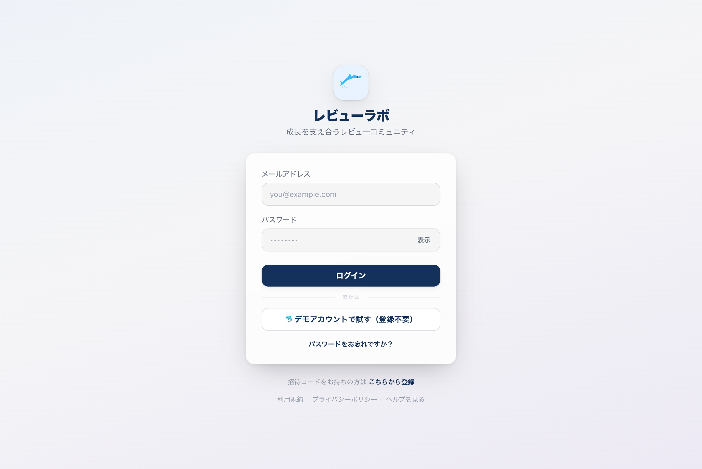
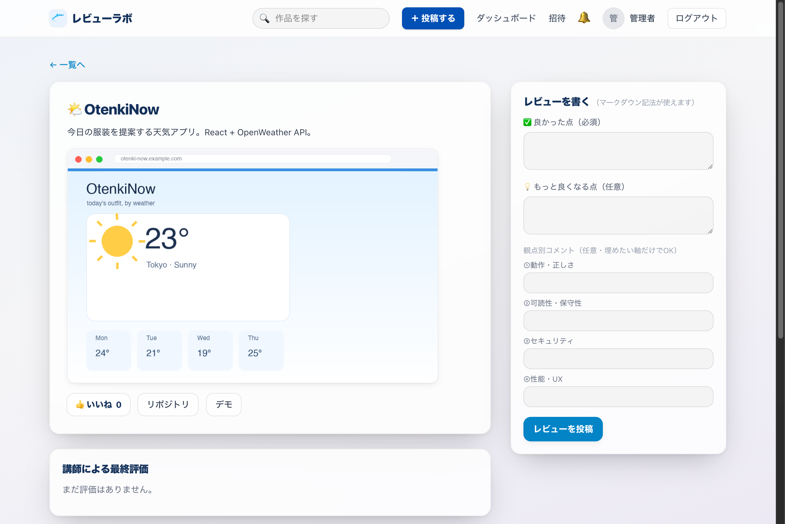
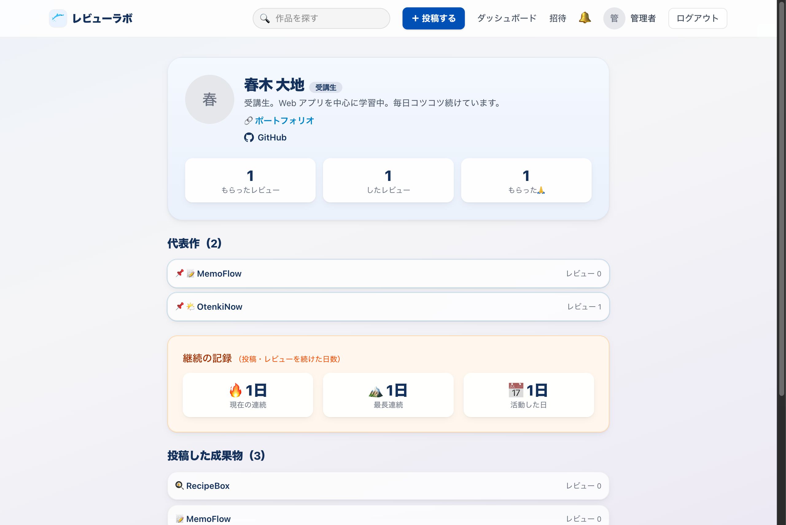

# レビューラボ（review-board）

> このフォルダは「外部共有用（受講生・関係者向け）」のやさしい版ドキュメントです。
> リポジトリ直下の `README.md` や `docs/` にある内部向け資料とは別物で、
> 内部用語・機密情報を含みません。共有はこのフォルダ（`共有用ドキュメント/`）を使ってください。

エンジニアスクールの受講生・講師が、作った成果物をお互いにレビューし合い、
その積み重ねを一人ひとりの「成長の記録」として残していく、クラス内クローズドのレビューコミュニティです。

## 概要

- 招待制・クラス（期）の中だけで見えるクローズド運用（誰でも登録はできない）
- ロールは受講生 / 講師 / 管理者
- 「投稿 → レビュー → 成長の記録」が中心。レビューする側の貢献も実績として可視化されます

## 主な機能

- 認証：メール＋パスワード、二要素認証（TOTP・リカバリコード）
- アカウント発行：講師 / 管理者が招待コードを発行し、受講生が登録
- 成果物の投稿：URL・スクリーンショット・説明・観点 / トーンのタグ
- レビュー：観点別コメント、「ありがとう」、ベストレビュー選択、返信
- 講師評価：合格 / 差し戻しと「合格バッジ」
- 成長の記録：投稿・もらった / したレビュー・連続活動日数
- プロフィール：自己紹介、アバター、ポートフォリオ URL、GitHub URL、代表作のピン留め（最大3件）
- 通知：アプリ内通知＋メール通知（任意設定・週次ダイジェスト）
- データ：自分のデータのエクスポート、退会（匿名化）

## 画面

### ログイン


### みんなの成果物（作品一覧）


### 投稿の詳細（レビューを書く）


### 成長の記録（プロフィール）


## 技術スタック

| 層 | 技術 | ローカルポート |
|---|---|---|
| フロントエンド | React 19 + Vite + Tailwind CSS | 5175 |
| バックエンド | Spring Boot 3.5 + Java 25（Gradle） | 8082 |
| データベース | PostgreSQL 16（Docker） | 5434 |
| オブジェクトストレージ | MinIO（本番は S3 互換） | 9002 / 9003 |
| インフラ | Terraform（AWS EC2 + RDS + S3） | — |
| CI/CD | GitHub Actions | — |

## ローカル開発

前提：Docker / Node.js（JDK は Gradle Toolchain が必要バージョンを自動取得）

```bash
# 1) DB + オブジェクトストレージ
docker-compose up -d

# 2) バックエンド（http://localhost:8082）
cd backend && ./gradlew bootRun

# 3) フロントエンド（http://localhost:5175）
cd frontend && npm install && npm run dev
```

使用ポートは 8082 / 5175 / 5434。ほかのアプリと衝突する場合は解放してから起動してください。

## アーキテクチャ（本番）

- nginx（静的配信＋リバースプロキシ）＋ Spring Boot（systemd）を EC2 上で稼働
- データベースは RDS（PostgreSQL）。スクリーンショットは S3 に非公開保存し、短命の署名付き URL でのみ配信
- HTTPS（Let's Encrypt）。認証は HttpOnly + Secure な Cookie
- GitHub Actions で不変アーティファクトをビルドして配布し、手動承認で本番へ反映

## セキュリティ

- ロールベースの権限管理。他人 / 他クラスのリソースへのアクセスは遮断（存在を漏らさない応答）
- 認証は短命のアクセストークン＋リフレッシュトークンのローテーション、二要素認証に対応
- 監査ログ、依存パッケージの脆弱性スキャン、機密情報スキャンを CI に常設

## テスト / CI

- バックエンド：ビルド＋結合テスト（Testcontainers）
- フロントエンド：Lint・ビルド
- セキュリティ：依存スキャン・機密情報スキャン・SBOM 生成
- E2E（Playwright スモーク）、性能テスト（k6）

## ドキュメント

詳しい設計・手順は同じフォルダの各ファイルを参照してください。

- 00 ログインのやり方（受講生向け）
- 01 デプロイとロールバックの手順
- 02 HTTPS（TLS）設定の手順
- 03 ログと監視・トラブル対応
- 04 権限と安全の考え方（脅威モデリング）
- 05 インフラ構成
- 06 テスト計画
- 07 要件の概要（背景・対象・差別化・主な機能）
- 08 品質への取り組み（自己評価）

## 備考

- 学習目的のクローズドなプロジェクトです（外部公開・SEO は現時点では対象外）。
- 共通の開発方針はリポジトリ外で管理しています。
